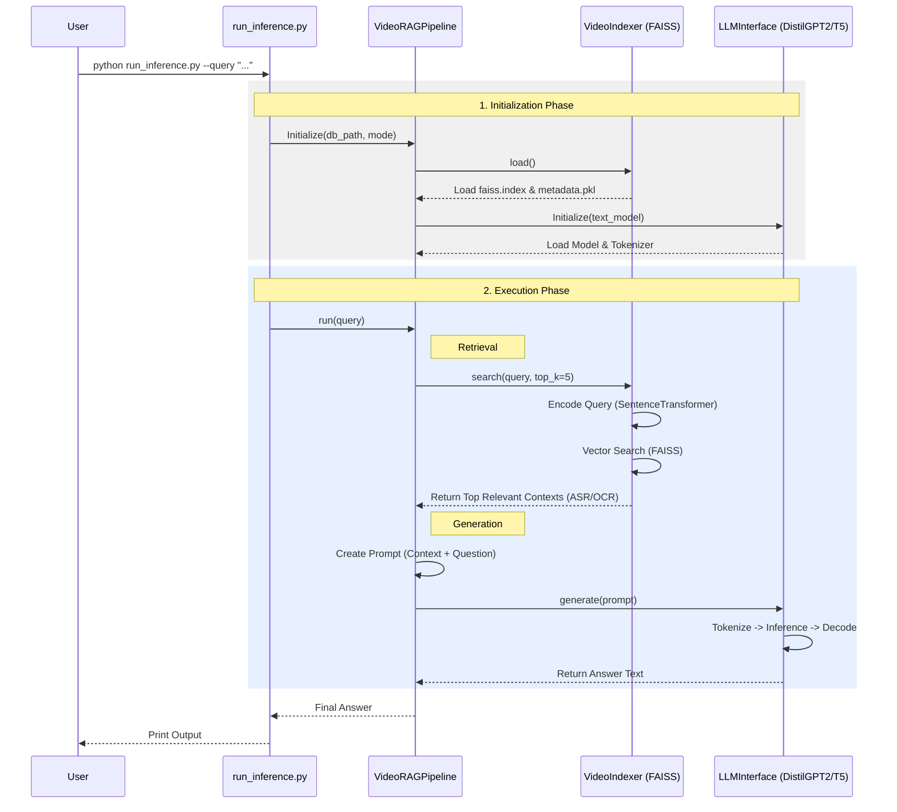

# Video-RAG

An implementation of Retrieval-Augmented Generation for Video, based on the research paper. This system extracts auxiliary text (ASR, OCR, Object Tags) from a video, indexes it, and uses it to answer questions.

## Features
- **ASR**: Whisper (OpenAI)
- **OCR**: EasyOCR
- **Object Detection**: YOLOv8 (Ultralytics)
- **Retrieval**: FAISS + SentenceTransformers
- **Generation**: LLaVA-Video (code support) or Text-only LLM (Flan-T5)

## Installation

1. **Install Dependencies**:
   ```bash
   cd video_rag
   ./scripts/setup_env.sh
   source .venv/bin/activate
   ```

2. **System Requirements**:
   - `ffmpeg` is required for audio extraction.
   - GPU recommended for faster processing.

## Usage

### 1. Ingest Video
Process a video to extract text and build the index.
```bash
python scripts/ingest_video.py --video path/to/video.mp4 --output db
```

### 2. Query
Ask a question about the video.
```bash
python run_inference.py --db db/video_name --query "What text is shown on the sign?"
```

## Testing
To run a quick verification with a simulated video:
```bash
# Generate dummy video
python scripts/create_dummy_video.py

# Ingest
python scripts/ingest_video.py --video test_video.mp4 --output db

# Query
python run_inference.py --db db/test_video --query "What objects are detected?"
```

## How it Works

The following diagram illustrates the flow when running an inference query:


