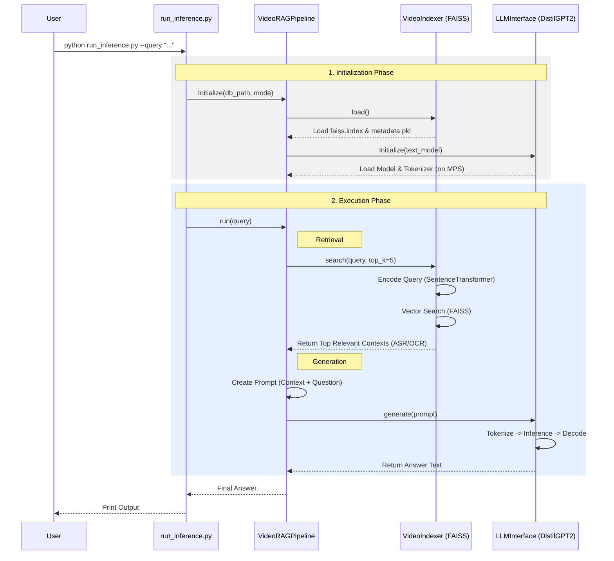

# Video RAG Inference Architecture

This diagram illustrates the process when you run the inference command.



## Detailed Steps

1.  **Loading**:
    *   The script loads the **FAISS Index** (vectors) and **Metadata** (text segments) from your disk (`db/christmas_run/test_video`).
    *   It loads the **LLM** (`distilgpt2`) into your Mac's GPU memory (MPS).

2.  **Retrieval**:
    *   Your question is converted into a vector.
    *   The system searches for the most similar vectors in the index.
    *   It finds the relevant segment: *"[ASR @ 33.04s]: Small evergreen trees were decorated..."*

3.  **Generation**:
    *   The system constructs a prompt:
        ```text
        Context:
        [ASR @ 33.04s]: Small evergreen trees were decorated...
        
        Question: how many berry, apple and candles...
        Answer:
        ```
    *   The LLM reads this prompt and completes the text to generate the answer.
